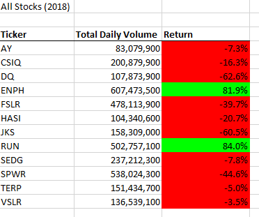
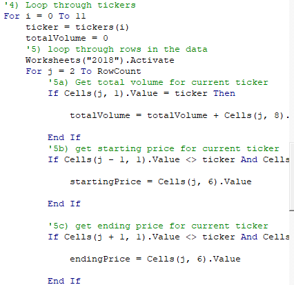
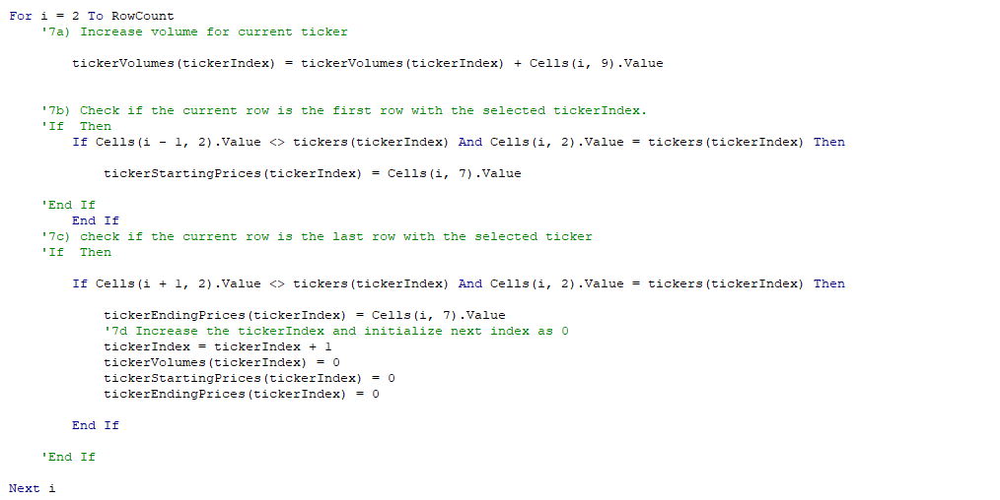
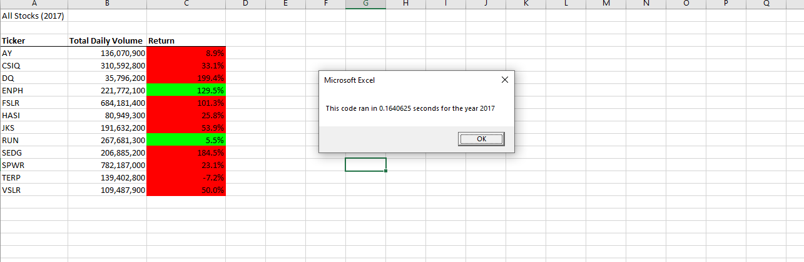
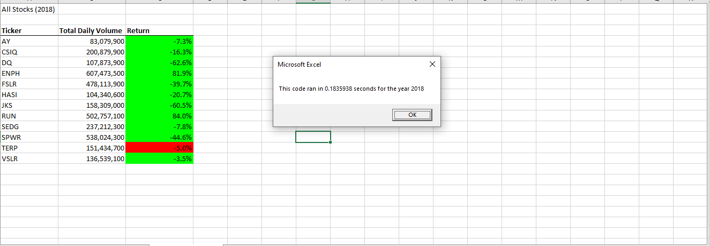

# Stocks Analysis (2017/2018)
This project was undertaken in order to streamline analysis of stock market data for the years of 2017 and 2018 by refactoring code from a previous project in an effort to increase machine performance so as to accomodate a larger stock market data set. By examining performances of past stock market data it will give a competitive advantage as to which stocks are performing well/underperforming. 

## Results

In the first iteration of this project, nested for loops were used in order to loop through the stock market data, accumulating information for each of those stocks as the loops ran. This information included the total volume among that the stocks were traded as well as the starting price and ending price for the stock. By collecting this information we were able to use basic calculations in order to measure stock performance data for the year:

---

The code for looping through the data was this:

We can see here our the outer loop (from i = 0 to 11) would loop through the different tickers (stock prices names) one by one while the inner loop (from j = 2 to rowcount) would check to see if the current rows stock name was the same as the current ticker in order to add volume to the total trading volume for that stock if it was. Additionally the code checked to see if the current row was the first instance of this stock being traded (by checking to see if the previous row was a different stock name) or the last instance (by checking to see if the next row was a different stock name). By doing this we were able to find the starting and ending prices of the stocks.

---

While this code was successfully displaying information on smaller scale data sets it ran into trouble when confronted with larger stock market sets as a result of being inefficient, thereby encountering run time troubles. The main inefficiency of the code was in how the nested for loops operated. In this manner of operating the code was checking the stock price name against every single row in the data set before moving on to the next ticker(stock price name) whereas in reality not every row of data needed to be analyzed for every stock, rather only the rows corresponding to the current stock should be checked.

---

Once this was realized, as the code began to experience run-time difficulties with a more robust data set, a refactored code was written that could handle the all the analysis for all of the stocks in one loop.

As we can see in this snippet of code rather than having a nested for loop, as in the previous example, the entirety of the analysis happens in one sweep of the data set. Rather than looping through the entirety of the data set for each of the different stocks this new code is adding values into an array for each one of the stocks. As soon as the code realizes it has reached the last instance of that stock it will increase the tickerIndex(this being the variable that loops through the arrays and determines the current stock we are on). By increasing this variable it is telling the code to move on to the next index in the array.

In this manner the run-time of the code was decreased drastically 

As we can see from the screenshots above the entirety of the run time for both the 2017 and 2018 analysis was done in a fraction of a second, a drastic decrease from the prior code.

##

